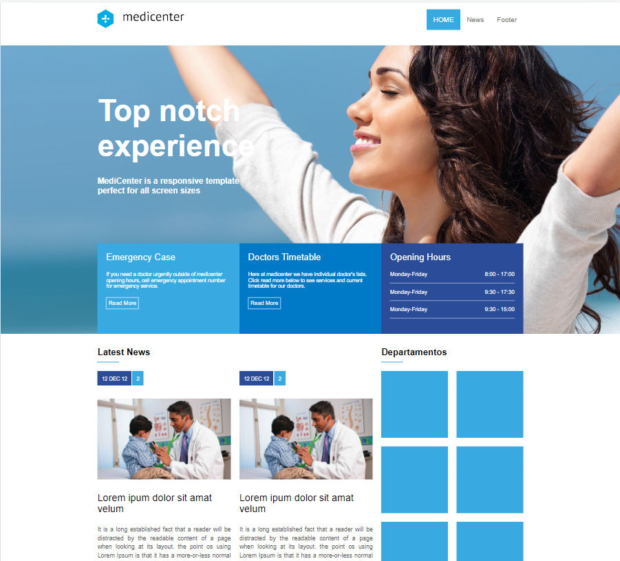
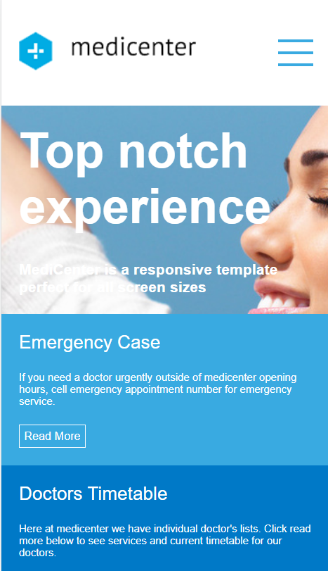

# clone do template MediCenter
## No que consiste este projeto?
Este projeto foi desenvolvido em aula e consiste em refazer apenas o desing do template
## Objetivo:
O objetivo desse projeto é aprimorar o conhecimento em html e css focando no estudo do flex box
## Demostração em Desktop

## Demostração Mobile

## Crédito
Este template tem o direito reservado para QuanticaLabs

